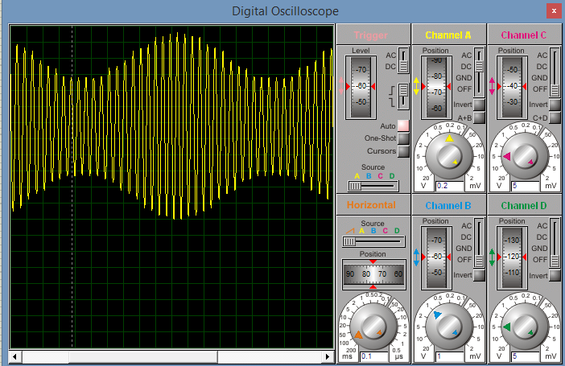

.. -*- coding: utf-8 -*-

.. _rcs_subversion:

Clase 05 - PIII 2018
====================
(Fecha: 19 de septiembre)

Ejercicio 6:
============

- Generar una señal de 4Hz pensado para aplicar un efecto trémolo (variación periódica del volumen) a una señal de audio que está siendo muestreada a 4kHz.

Ejercicio 7:
============

- Aplicar el trémolo de 4Hz a la señal generada de 100Hz.

Ejercicio 8:
============

- Muestrear una señal de audio y aplicar el trémolo anterior.

