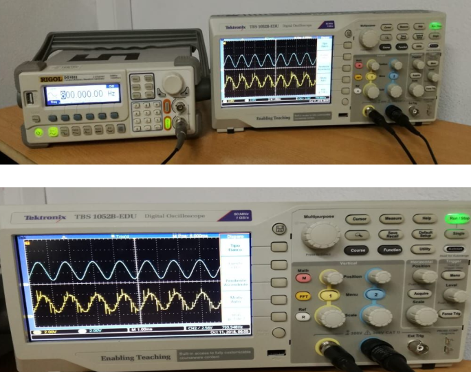

.. -*- coding: utf-8 -*-

.. _rcs_subversion:

Clase 07 - PIII 2018
====================
(Fecha: 10 de octubre)

Primera entrega de prácticos finales
====================================

**Identificador de tonos DTMF ( Agustina Alvarez - Carlos Ignacio )** 

**Reconocimiento de voz ( Karraz Facundo - Gutierrez Julian )** 

.. figure:: resources/clase07/PrimeraEntrega-Julian-Facundo.png
	:target: resources/clase07/PrimeraEntrega-Julian-Facundo.pdf

